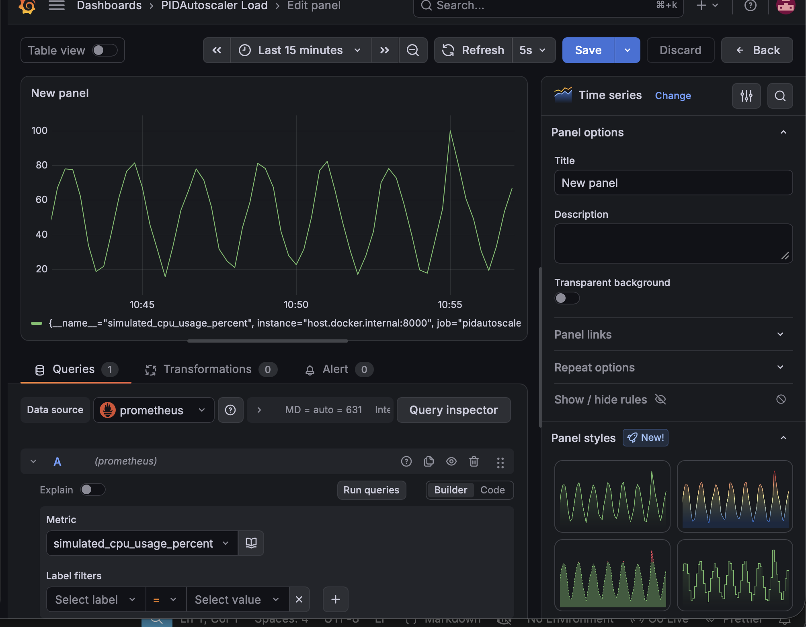
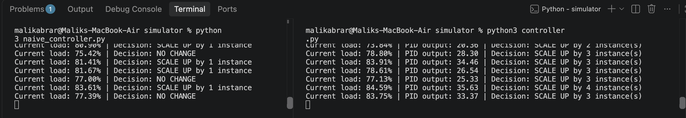
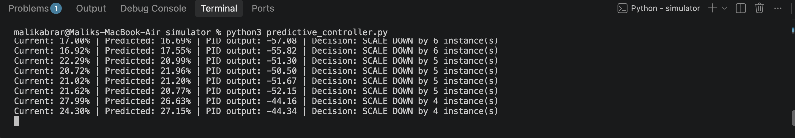

# PIDAutoscaler

PID-controller-based autoscaler with ML-driven load prediction to proactively 
scale infrastructure and reduce oscillation vs. threshold-based autoscaling.

## What it does

Replaces naive threshold-based autoscaling (like default Kubernetes HPA) with 
a PID control loop, reducing overshoot and oscillation. The system is monitored 
end-to-end with Prometheus and Grafana, and enhanced with an ARIMA-based 
time-series prediction layer that forecasts load ahead of time, enabling the 
controller to scale proactively before traffic spikes hit rather than reacting 
after the fact.

## Live monitoring dashboard



*Real-time CPU load simulation scraped by Prometheus and visualized in Grafana, 
updating every 5 seconds.*

## Naive vs PID comparison



*At the same load levels, the naive threshold controller shows "NO CHANGE" 
the entire time since neither threshold is crossed, while the PID controller 
continuously scales in proportion to the drift — reacting earlier and more 
smoothly.*

## Predictive PID in action



*The ARIMA predictor forecasts load ahead of the PID setpoint, so scaling 
decisions anticipate where load is heading rather than only reacting to where 
it currently is.*

## Architecture

- **app.py** — simulates a server's fluctuating CPU load (sine wave + noise + 
  occasional spikes), exposed via both a JSON endpoint and a Prometheus-format 
  metrics endpoint
- **controller.py** — reactive PID controller that polls current load and 
  computes scaling decisions using proportional, integral, and derivative terms
- **naive_controller.py** — simple threshold-based baseline (mimics default 
  Kubernetes HPA behavior) used for comparison against the PID approach
- **predictor.py** — standalone ARIMA time-series model that forecasts load 
  several intervals ahead based on recent history
- **predictive_controller.py** — combines the PID controller with the ARIMA 
  predictor, feeding *forecasted* load into the control loop instead of only 
  current load, enabling proactive rather than purely reactive scaling
- **Prometheus** — scrapes simulated load metrics every 5 seconds
- **Grafana** — visualizes live and historical load data
- **Dockerfile / deployment.yaml** — containerizes the simulator and defines 
  Kubernetes deployment/service manifests

## Key engineering decisions

- **Anti-windup clamping**: bounded the PID integral term to prevent unbounded 
  growth during sustained load deviation, which otherwise caused runaway 
  scaling recommendations
- **Corrected error direction**: standard PID convention (`setpoint - current`) 
  assumes driving a value down to a target; autoscaling needs the opposite 
  (scale up when load exceeds target), so the error term was inverted to 
  `current - setpoint` to match the domain
- **Fixed stale metrics bug**: the Prometheus metrics endpoint initially read a 
  cached `current_load` value instead of triggering fresh computation on each 
  scrape, causing a flat/stale graph — refactored both endpoints to share a 
  single `calculate_load()` function
- **Prediction fallback**: `predictive_controller.py` falls back to current 
  load if fewer than 15 historical readings are available, since ARIMA needs 
  a minimum window to fit meaningfully — avoids feeding garbage predictions 
  into the control loop during startup

## Kubernetes deployment

The simulator is containerized with Docker, and Kubernetes deployment/service 
manifests (`deployment.yaml`) are included. Local deployment via Docker 
Desktop's embedded Kubernetes hit a known `ErrImageNeverPull` limitation, 
where locally-built images aren't visible to its isolated image store — 
resolvable with a local registry or `minikube`, but out of scope for this 
project's core focus on control theory and prediction.

## How to run

```bash
# Terminal 1 — start the load simulator
cd simulator
python3 -m uvicorn app:app --reload --port 8000

# Terminal 2 — run the naive baseline
python3 naive_controller.py

# Terminal 3 — run the reactive PID controller
python3 controller.py

# Terminal 4 — run the predictive PID controller
python3 predictive_controller.py